# E-Commerce App

A modern Flutter e-commerce application built with **Flutter, Firebase, REST API, and BLoC**.

This project was built to practice and demonstrate how a real-world Flutter application can be structured using **Clean Architecture, feature-first folder structure, state management, API integration, Firebase, and asynchronous data handling**.

## 📸 Screenshots

  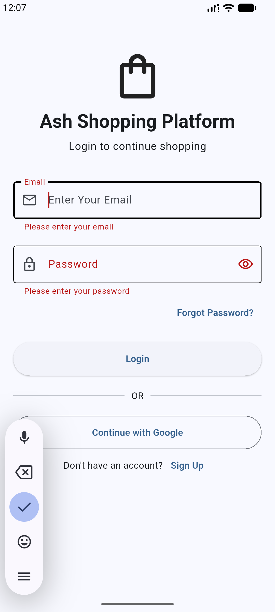
  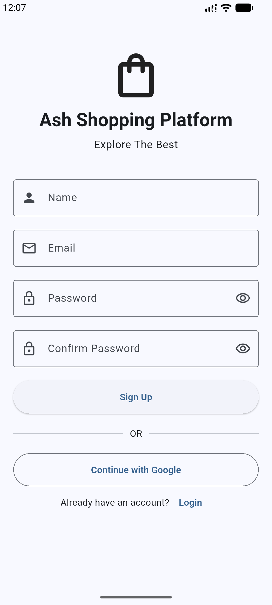
  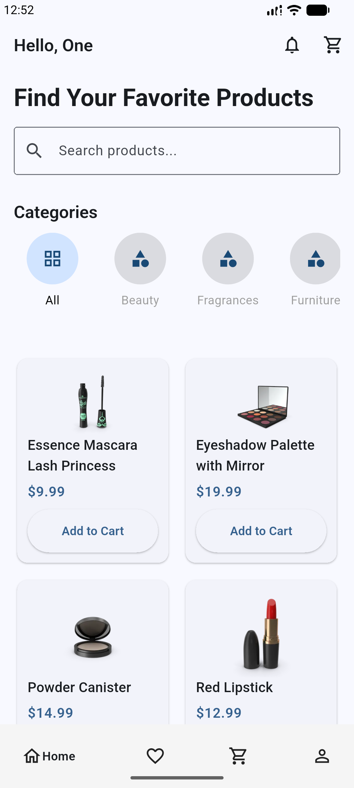

  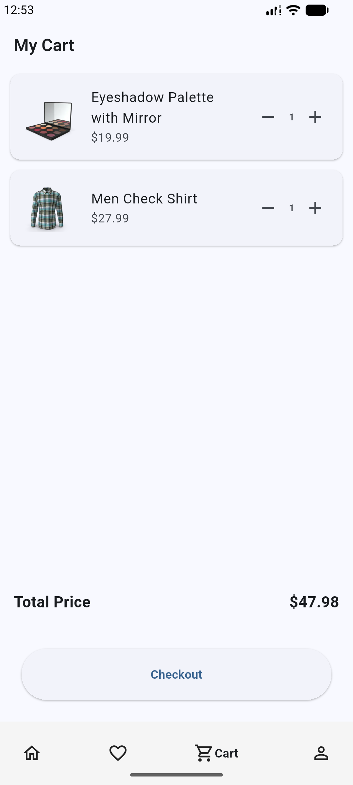
  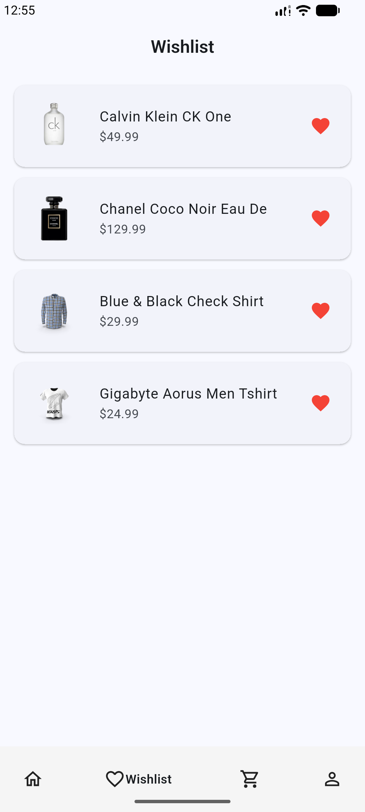
  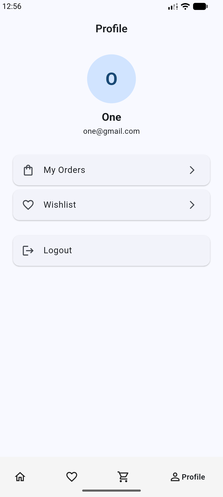

  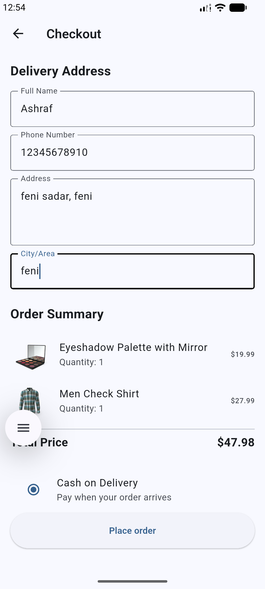
  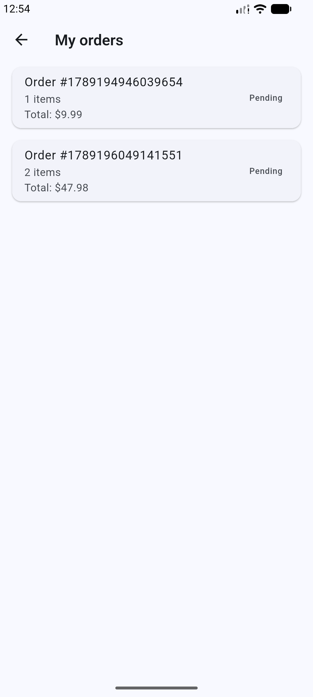
  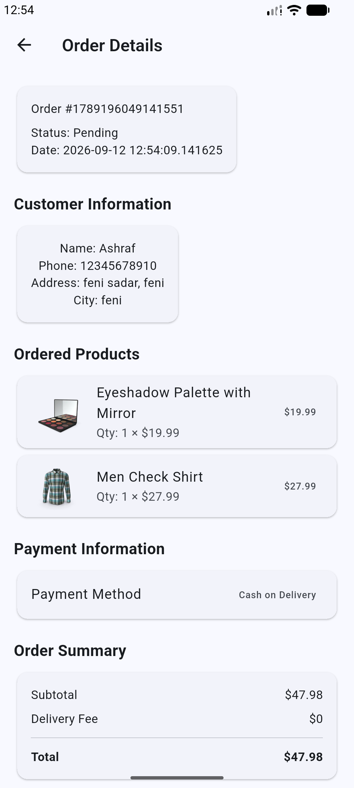

  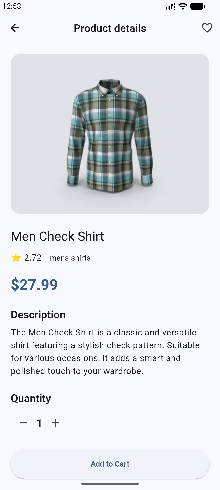
  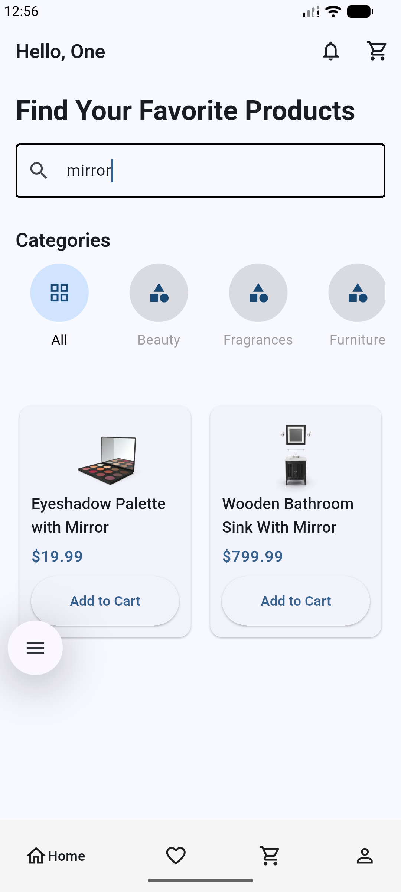

##  Features

-  User Authentication (Login & Sign Up)
-  Product Browsing
-  Product Search with Debounce
-  Category Filtering
-  Product Details
-  Cart Management
-  Wishlist
-  Checkout
-  Order Management
-  User Profile
-  Firebase Authentication & Firestore
-  REST API Integration

## Technologies & Packages

- **Flutter & Dart**
- **BLoC / Cubit**
- **Clean Architecture**
- **Feature-First Architecture**
- **Dio** — API integration
- **Firebase Authentication**
- **Cloud Firestore**
- **Equatable**
- **Stream Transform** — Debounce
- **Git & GitHub**

## API

Products are fetched from the **DummyJSON REST API**.
